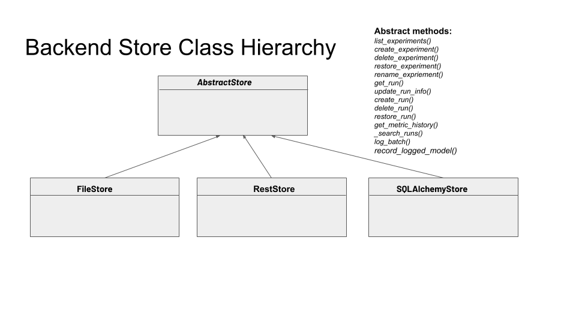
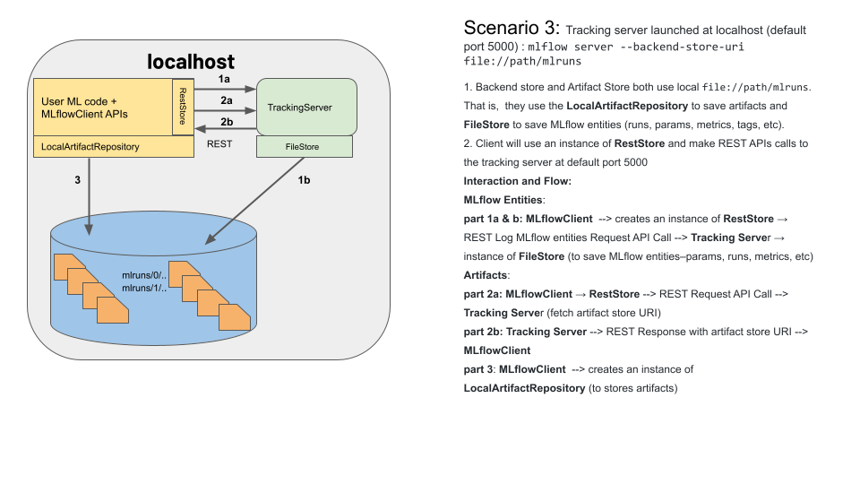

### MLflow Backend and Artifact Stores

The MLflow platform uses two stores, a backend store and an artifact store.
While the backend store persists MLflow entities—runs, parameters, metrics, 
tags, etc—, the artifact store saves all artifacts–models, images, summary, etc.

What backend store or artifact store is used and by whom depends on four different 
scenarios. What's more, under each scenario, the relevant code will instantiate an
instance of a concrete class. The diagram below shows the class hierarchy of each
abstract class: `AbstractStore` and `ArtifactRepository`.

#### Backend Store Class Hierarchy

#### Artifact Store Class Hierarchy

##### Scenario 1

MLflow on the localhost 

#### Scenario 2 

MLflow on the localhost with backstore as SQLAlchemy

#### Scenario 3

Tracking server launched at localhost (default port 5000): 
`mlflow server --backend-store-uri file:/path/my_mlruns`

#### Scenario 4

Tracking server launched at a remote host along with an artifact location 
and SQLAlchemy compatible backend store. This scenario can have two cases:

Case 1: 

`mlflow server --backend-store-uri sqlite:///my_mlruns.db --host hostname
--default-artifact-root file:/mnt/my_artifacts`

Case 2:

`mlflow server --backend-store-uri postgresql://URI --default-artifact-root S3:/bucket_name --host hostname`

