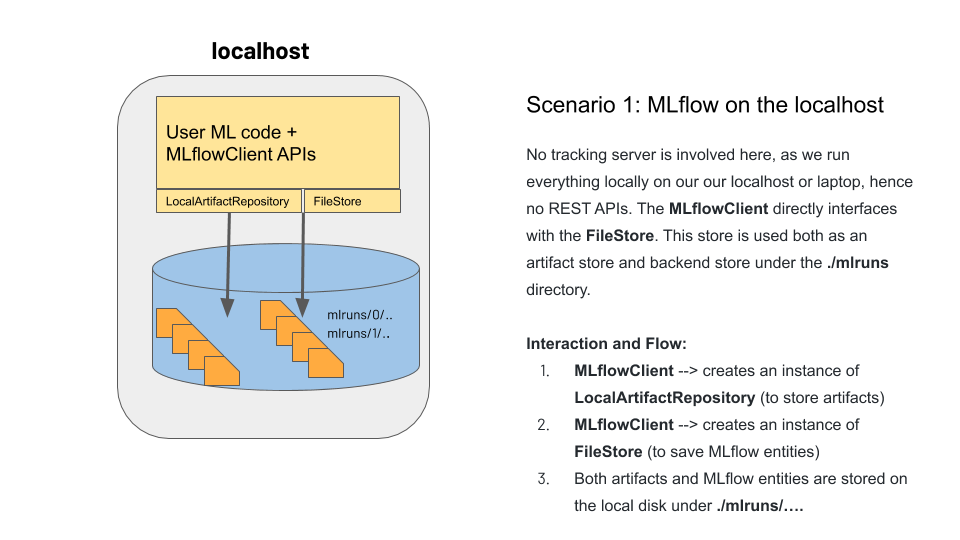
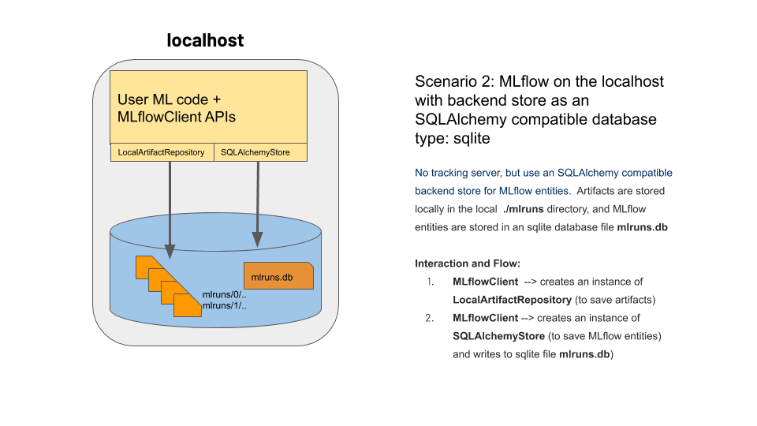

## MLflow Backend and Artifact Stores

The MLflow platform uses two stores: a backend store and an artifact store.
While the backend store persists MLflow entities—runs, parameters, metrics, 
tags, etc—, the artifact store saves all artifacts–models, images, model summary, etc.

Which backend store or artifact store is used, and by a client or tracking server, 
depends on four different scenarios. What's more, under each scenario, the relevant 
component code will instantiate an instance of a concrete class to interface with the 
target store. The diagram below shows the two class hierarchies: abstract class: 
`AbstractStore` and `ArtifactRepository`.

 * [AbstractStore](https://github.com/mlflow/mlflow/blob/master/mlflow/store/tracking/abstract_store.py)
 * [FileStore](https://github.com/mlflow/mlflow/blob/master/mlflow/store/tracking/file_store.py)
 * [RestStore](https://github.com/mlflow/mlflow/blob/master/mlflow/store/tracking/rest_store.py)
 * [SQLAlchmeyStore](https://github.com/mlflow/mlflow/blob/master/mlflow/store/tracking/sqlalchemy_store.py)

The Abstract and concrete classes for all supported artifact stores are defined
[here](https://github.com/mlflow/mlflow/tree/master/mlflow/store/artifact).

### Scenario 1

MLflow on the localhost 

### Scenario 2 

MLflow on the localhost with backend store as an SQLAlchemy compatible database
sqlite

### Scenario 3

Tracking server launched at localhost (default port 5000):

`mlflow server --backend-store-uri file:/path/my_mlruns`

### Scenario 4

Tracking server launched at a remote host along with an artifact location 
and SQLAlchemy compatible backend store. This scenario can have two cases:

`mlflow server --backend-store-uri postgresql://URI --default-artifact-root S3:/bucket_name --host hostname`

